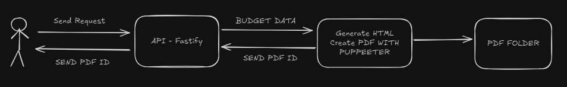

# Budget-io

Web service para geração de orçamentos em PDF

## Rotas

`POST /` Criar PDF


O corpo da requisição precisa ter os seguintes dados.

```json
{
  "company": {
    "name": "",
    "id": "",
    "address": "",
    "fone": "",
    "email": ""
  },
  "client": {
    "name": "",
    "id": "",
    "address": "",
    "fone": "",
    "email": ""
  },
  "products": [
    {
      "code": "",
      "description": "",
      "quant": 0,
      "price": 0,
      "totalPrice": 0
    }
  ]
}
```
Em caso de sucesse a resposta da API sera uma mensagem confirmando a criação e um ID para o download do PDF
```json
{
	"message": "PDF generated successfully",
	"pdfId": "id-para-download-do-orçamento"
}
```

`GET /:id` Download do PDF


A rota precisa que seja passado um ID valido para o download do PDF
Caso o ID seja invalido a API ira retorna um erro